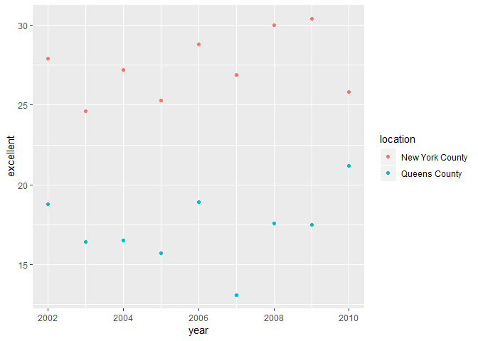

p8105\_hw2\_fwt2107
================
Felix Tran
September 29, 2018

Problem 1
=========

Reading and cleaning the dataset
--------------------------------

First, we read in the dataset, clean the variable names, select which variables to keep, and recode entry from a character variable (YES/NO) to a logical variable (T/F)

``` r
mta_df <- read_csv('./Data/NYC_Transit_Subway_Entrance_And_Exit_Data.csv') %>% 
  janitor::clean_names() %>% 
  select(line, station_name, station_latitude, station_longitude, 
         route1:route11, entry, vending, entrance_type, ada) %>% 
  mutate(entry = ifelse(entry == 'YES', TRUE, FALSE))
```

    ## Parsed with column specification:
    ## cols(
    ##   .default = col_character(),
    ##   `Station Latitude` = col_double(),
    ##   `Station Longitude` = col_double(),
    ##   Route8 = col_integer(),
    ##   Route9 = col_integer(),
    ##   Route10 = col_integer(),
    ##   Route11 = col_integer(),
    ##   ADA = col_logical(),
    ##   `Free Crossover` = col_logical(),
    ##   `Entrance Latitude` = col_double(),
    ##   `Entrance Longitude` = col_double()
    ## )

    ## See spec(...) for full column specifications.

``` r
mta_df
```

    ## # A tibble: 1,868 x 19
    ##    line  station_name station_latitude station_longitu~ route1 route2
    ##    <chr> <chr>                   <dbl>            <dbl> <chr>  <chr> 
    ##  1 4 Av~ 25th St                  40.7            -74.0 R      <NA>  
    ##  2 4 Av~ 25th St                  40.7            -74.0 R      <NA>  
    ##  3 4 Av~ 36th St                  40.7            -74.0 N      R     
    ##  4 4 Av~ 36th St                  40.7            -74.0 N      R     
    ##  5 4 Av~ 36th St                  40.7            -74.0 N      R     
    ##  6 4 Av~ 45th St                  40.6            -74.0 R      <NA>  
    ##  7 4 Av~ 45th St                  40.6            -74.0 R      <NA>  
    ##  8 4 Av~ 45th St                  40.6            -74.0 R      <NA>  
    ##  9 4 Av~ 45th St                  40.6            -74.0 R      <NA>  
    ## 10 4 Av~ 53rd St                  40.6            -74.0 R      <NA>  
    ## # ... with 1,858 more rows, and 13 more variables: route3 <chr>,
    ## #   route4 <chr>, route5 <chr>, route6 <chr>, route7 <chr>, route8 <int>,
    ## #   route9 <int>, route10 <int>, route11 <int>, entry <lgl>,
    ## #   vending <chr>, entrance_type <chr>, ada <lgl>

``` r
View(mta_df)
```

Describing the data
-------------------

This dataset contains information about the entrances for NYC's subway stations. Variables include the route name, station name, station coordinates, routes serviced at the station, whether or not the entrance allows entry into the station, whether or not the station includes a ticket vending machine, the type of entrance (e.g. stairs, door, etc.), and whether or not the entrance is ADA-compliant.

The resulting dataset is 1868 rows by 19 columns.

These data are not tidy because each row contain 2 pieces of information: how many routes are serviced at the particular station, and which routes are serviced. Someone could tell visually how many routes and which routes are serviced at a particular station, but determining that information in R is not as straightforward given how the data are currently formmated. The data could be tidied by making each row one route. The entry variable could also be reformatted from character to logical for ease of use in analysis.

Answering questions
-------------------

Only keeping distinct values of line and station\_name gives us a dataframe with 465 rows. There are 465 distinct stations.

``` r
distinct(mta_df, line, station_name, .keep_all = T)
```

    ## # A tibble: 465 x 19
    ##    line  station_name station_latitude station_longitu~ route1 route2
    ##    <chr> <chr>                   <dbl>            <dbl> <chr>  <chr> 
    ##  1 4 Av~ 25th St                  40.7            -74.0 R      <NA>  
    ##  2 4 Av~ 36th St                  40.7            -74.0 N      R     
    ##  3 4 Av~ 45th St                  40.6            -74.0 R      <NA>  
    ##  4 4 Av~ 53rd St                  40.6            -74.0 R      <NA>  
    ##  5 4 Av~ 59th St                  40.6            -74.0 N      R     
    ##  6 4 Av~ 77th St                  40.6            -74.0 R      <NA>  
    ##  7 4 Av~ 86th St                  40.6            -74.0 R      <NA>  
    ##  8 4 Av~ 95th St                  40.6            -74.0 R      <NA>  
    ##  9 4 Av~ 9th St                   40.7            -74.0 F      G     
    ## 10 4 Av~ Atlantic Av~             40.7            -74.0 B      Q     
    ## # ... with 455 more rows, and 13 more variables: route3 <chr>,
    ## #   route4 <chr>, route5 <chr>, route6 <chr>, route7 <chr>, route8 <int>,
    ## #   route9 <int>, route10 <int>, route11 <int>, entry <lgl>,
    ## #   vending <chr>, entrance_type <chr>, ada <lgl>

Keeping distinct values of line and station\_name plus filtering out stations which weren't ADA-compliant gives us a dataframe with 84 rows. 84 stations are ADA-compliant.

``` r
distinct(mta_df, line, station_name, .keep_all = T) %>% 
  filter(ada == T)
```

    ## # A tibble: 84 x 19
    ##    line  station_name station_latitude station_longitu~ route1 route2
    ##    <chr> <chr>                   <dbl>            <dbl> <chr>  <chr> 
    ##  1 4 Av~ Atlantic Av~             40.7            -74.0 B      Q     
    ##  2 4 Av~ DeKalb Av                40.7            -74.0 B      Q     
    ##  3 4 Av~ Pacific St               40.7            -74.0 B      Q     
    ##  4 42nd~ Grand Centr~             40.8            -74.0 GS     4     
    ##  5 6 Av~ 34th St                  40.7            -74.0 B      D     
    ##  6 6 Av~ 47-50th Sts~             40.8            -74.0 B      D     
    ##  7 6 Av~ Church Av                40.6            -74.0 F      <NA>  
    ##  8 63rd~ 21st St                  40.8            -73.9 F      <NA>  
    ##  9 63rd~ Lexington Av             40.8            -74.0 F      <NA>  
    ## 10 63rd~ Roosevelt I~             40.8            -74.0 F      <NA>  
    ## # ... with 74 more rows, and 13 more variables: route3 <chr>,
    ## #   route4 <chr>, route5 <chr>, route6 <chr>, route7 <chr>, route8 <int>,
    ## #   route9 <int>, route10 <int>, route11 <int>, entry <lgl>,
    ## #   vending <chr>, entrance_type <chr>, ada <lgl>

Filtering out observations for entrances/exits without vending gives us a dataset with 183 rows. There are 183 entrances/exits without vending.

``` r
filter(mta_df, vending == 'NO')
```

    ## # A tibble: 183 x 19
    ##    line  station_name station_latitude station_longitu~ route1 route2
    ##    <chr> <chr>                   <dbl>            <dbl> <chr>  <chr> 
    ##  1 4 Av~ 53rd St                  40.6            -74.0 R      <NA>  
    ##  2 4 Av~ 77th St                  40.6            -74.0 R      <NA>  
    ##  3 4 Av~ 9th St                   40.7            -74.0 F      G     
    ##  4 4 Av~ Bay Ridge Av             40.6            -74.0 R      <NA>  
    ##  5 42nd~ Grand Centr~             40.8            -74.0 GS     4     
    ##  6 42nd~ Grand Centr~             40.8            -74.0 GS     4     
    ##  7 6 Av~ 7th Av                   40.7            -74.0 F      <NA>  
    ##  8 6 Av~ 7th Av                   40.7            -74.0 F      <NA>  
    ##  9 6 Av~ 7th Av                   40.7            -74.0 F      <NA>  
    ## 10 6 Av~ 7th Av                   40.7            -74.0 F      <NA>  
    ## # ... with 173 more rows, and 13 more variables: route3 <chr>,
    ## #   route4 <chr>, route5 <chr>, route6 <chr>, route7 <chr>, route8 <int>,
    ## #   route9 <int>, route10 <int>, route11 <int>, entry <lgl>,
    ## #   vending <chr>, entrance_type <chr>, ada <lgl>

Filtering out entrances/exits without vending and no entry gives us a dataset with 69 rows. There are 69 entrances/exits without vending which allow entrance. Therefore, 69/183 or about 37.7% of station entrances/exits without vending allow entrance.

``` r
filter(mta_df, vending == 'NO', entry == T)
```

    ## # A tibble: 69 x 19
    ##    line  station_name station_latitude station_longitu~ route1 route2
    ##    <chr> <chr>                   <dbl>            <dbl> <chr>  <chr> 
    ##  1 4 Av~ 9th St                   40.7            -74.0 F      G     
    ##  2 6 Av~ 7th Av                   40.7            -74.0 F      <NA>  
    ##  3 6 Av~ 7th Av                   40.7            -74.0 F      <NA>  
    ##  4 6 Av~ 7th Av                   40.7            -74.0 F      <NA>  
    ##  5 6 Av~ 7th Av                   40.7            -74.0 F      <NA>  
    ##  6 6 Av~ 7th Av                   40.7            -74.0 F      <NA>  
    ##  7 6 Av~ 7th Av                   40.7            -74.0 F      <NA>  
    ##  8 6 Av~ 7th Av                   40.7            -74.0 F      <NA>  
    ##  9 6 Av~ 7th Av                   40.7            -74.0 F      <NA>  
    ## 10 6 Av~ Bergen St                40.7            -74.0 F      G     
    ## # ... with 59 more rows, and 13 more variables: route3 <chr>,
    ## #   route4 <chr>, route5 <chr>, route6 <chr>, route7 <chr>, route8 <int>,
    ## #   route9 <int>, route10 <int>, route11 <int>, entry <lgl>,
    ## #   vending <chr>, entrance_type <chr>, ada <lgl>

First, we gather the data so that each row corresponds to 1 route. Then we only keep the observations for the A route. Finally we keep distinct values of line and station\_name to give us a dataframe with 60 rows. 60 distinct stations service the A.

``` r
gather(mta_df, key = route_num, value = route_name, route1:route11) %>% 
  filter(route_name == 'A') %>% 
  distinct(line, station_name, .keep_all = T)
```

    ## # A tibble: 60 x 10
    ##    line  station_name station_latitude station_longitu~ entry vending
    ##    <chr> <chr>                   <dbl>            <dbl> <lgl> <chr>  
    ##  1 42nd~ Times Square             40.8            -74.0 TRUE  YES    
    ##  2 8 Av~ 125th St                 40.8            -74.0 TRUE  YES    
    ##  3 8 Av~ 145th St                 40.8            -73.9 TRUE  YES    
    ##  4 8 Av~ 14th St                  40.7            -74.0 TRUE  YES    
    ##  5 8 Av~ 168th St - ~             40.8            -73.9 TRUE  YES    
    ##  6 8 Av~ 175th St                 40.8            -73.9 TRUE  YES    
    ##  7 8 Av~ 181st St                 40.9            -73.9 TRUE  YES    
    ##  8 8 Av~ 190th St                 40.9            -73.9 TRUE  YES    
    ##  9 8 Av~ 34th St                  40.8            -74.0 TRUE  YES    
    ## 10 8 Av~ 42nd St                  40.8            -74.0 TRUE  YES    
    ## # ... with 50 more rows, and 4 more variables: entrance_type <chr>,
    ## #   ada <lgl>, route_num <chr>, route_name <chr>

Copying over our most recent pipeline and then filtering out stations which are not ADA-compliant gives us a dataframe with 17 rows. 17 distinct stations which service the A are ADA-compliant.

``` r
gather(mta_df, key = route_num, value = route_name, route1:route11) %>% 
  filter(route_name == 'A') %>% 
  distinct(line, station_name, .keep_all = T) %>% 
  filter(ada == T)
```

    ## # A tibble: 17 x 10
    ##    line  station_name station_latitude station_longitu~ entry vending
    ##    <chr> <chr>                   <dbl>            <dbl> <lgl> <chr>  
    ##  1 8 Av~ 14th St                  40.7            -74.0 TRUE  YES    
    ##  2 8 Av~ 168th St - ~             40.8            -73.9 TRUE  YES    
    ##  3 8 Av~ 175th St                 40.8            -73.9 TRUE  YES    
    ##  4 8 Av~ 34th St                  40.8            -74.0 TRUE  YES    
    ##  5 8 Av~ 42nd St                  40.8            -74.0 TRUE  YES    
    ##  6 8 Av~ 59th St                  40.8            -74.0 TRUE  YES    
    ##  7 8 Av~ Inwood - 20~             40.9            -73.9 TRUE  YES    
    ##  8 8 Av~ West 4th St              40.7            -74.0 TRUE  YES    
    ##  9 8 Av~ World Trade~             40.7            -74.0 TRUE  YES    
    ## 10 Broa~ Times Squar~             40.8            -74.0 TRUE  YES    
    ## 11 Broa~ 59th St-Col~             40.8            -74.0 TRUE  YES    
    ## 12 Broa~ Times Square             40.8            -74.0 TRUE  YES    
    ## 13 Cana~ 8th Av                   40.7            -74.0 TRUE  YES    
    ## 14 Fran~ Franklin Av              40.7            -74.0 TRUE  YES    
    ## 15 Fult~ Euclid Av                40.7            -73.9 TRUE  YES    
    ## 16 Fult~ Franklin Av              40.7            -74.0 TRUE  YES    
    ## 17 Rock~ Howard Beach             40.7            -73.8 TRUE  YES    
    ## # ... with 4 more variables: entrance_type <chr>, ada <lgl>,
    ## #   route_num <chr>, route_name <chr>

Problem 2
=========

Mr. Trash Wheel
---------------

First we read in the data. Then we clean the variable names, filter out rows which are not for specific dumpsters, and change the sports\_ball variable into integer.

``` r
trashwheel_df <- 
  readxl::read_excel('./Data/HealthyHarborWaterWheelTotals2017-9-26.xlsx', 
                     range = "A2:N258") %>% 
  janitor::clean_names() %>%
  filter(!is.na(dumpster)) %>% 
  mutate(sports_balls = as.integer(sports_balls))
  
trashwheel_df
```

    ## # A tibble: 215 x 14
    ##    dumpster month  year date                weight_tons volume_cubic_ya~
    ##       <dbl> <chr> <dbl> <dttm>                    <dbl>            <dbl>
    ##  1        1 May    2014 2014-05-16 00:00:00        4.31               18
    ##  2        2 May    2014 2014-05-16 00:00:00        2.74               13
    ##  3        3 May    2014 2014-05-16 00:00:00        3.45               15
    ##  4        4 May    2014 2014-05-17 00:00:00        3.1                15
    ##  5        5 May    2014 2014-05-17 00:00:00        4.06               18
    ##  6        6 May    2014 2014-05-20 00:00:00        2.71               13
    ##  7        7 May    2014 2014-05-21 00:00:00        1.91                8
    ##  8        8 May    2014 2014-05-28 00:00:00        3.7                16
    ##  9        9 June   2014 2014-06-05 00:00:00        2.52               14
    ## 10       10 June   2014 2014-06-11 00:00:00        3.76               18
    ## # ... with 205 more rows, and 8 more variables: plastic_bottles <dbl>,
    ## #   polystyrene <dbl>, cigarette_butts <dbl>, glass_bottles <dbl>,
    ## #   grocery_bags <dbl>, chip_bags <dbl>, sports_balls <int>,
    ## #   homes_powered <dbl>

Precipitation 2016 and 2017
---------------------------

First we read in the precipitation 2016 and 2017 data, and then we clean the variable names, add a year variable, and filter out rows with no rain data.

``` r
precip2016_df <- 
  readxl::read_excel('./Data/HealthyHarborWaterWheelTotals2017-9-26.xlsx',
                     sheet = '2016 Precipitation', range = 'A2:B14') %>% 
  janitor::clean_names() %>% 
  mutate(year = 2016)
precip2016_df
```

    ## # A tibble: 12 x 3
    ##    month total  year
    ##    <dbl> <dbl> <dbl>
    ##  1     1  3.23  2016
    ##  2     2  5.32  2016
    ##  3     3  2.24  2016
    ##  4     4  1.78  2016
    ##  5     5  5.19  2016
    ##  6     6  3.2   2016
    ##  7     7  6.09  2016
    ##  8     8  3.96  2016
    ##  9     9  4.53  2016
    ## 10    10  0.62  2016
    ## 11    11  1.47  2016
    ## 12    12  2.32  2016

``` r
precip2017_df <-
  readxl::read_excel('./Data/HealthyHarborWaterWheelTotals2017-9-26.xlsx',
                     sheet = '2017 Precipitation', range = 'A2:B14') %>% 
  janitor::clean_names() %>% 
  mutate(year = 2017) %>% 
  filter(!is.na(total))
```

We combine the precipitation datasets and convert month to a character variable.

``` r
precip_combined_df <- full_join(precip2016_df, precip2017_df) %>% 
  mutate(month = month.name[month])
```

    ## Joining, by = c("month", "total", "year")

``` r
precip_combined_df
```

    ## # A tibble: 20 x 3
    ##    month     total  year
    ##    <chr>     <dbl> <dbl>
    ##  1 January    3.23  2016
    ##  2 February   5.32  2016
    ##  3 March      2.24  2016
    ##  4 April      1.78  2016
    ##  5 May        5.19  2016
    ##  6 June       3.2   2016
    ##  7 July       6.09  2016
    ##  8 August     3.96  2016
    ##  9 September  4.53  2016
    ## 10 October    0.62  2016
    ## 11 November   1.47  2016
    ## 12 December   2.32  2016
    ## 13 January    2.34  2017
    ## 14 February   1.46  2017
    ## 15 March      3.57  2017
    ## 16 April      3.99  2017
    ## 17 May        5.64  2017
    ## 18 June       1.4   2017
    ## 19 July       7.09  2017
    ## 20 August     4.44  2017

Data descriptions
-----------------

The Mr. Trash Wheel dataset contains 215 observations. It contains variables such as the dumpster number, date, and counts of particular items in each dumpster such as sports balls, plastic bags, and cigarette butts.

The combined precipitation 2016-2017 dataset contains 20 observations. It contains variables such as the month, year, and amount of precipitation in inches per month.

Total precipitation in 2017 was 29.93 inches.

The median number of sports balls in a dumpster in 2016 was 26.

Problem 3
=========

Cleaning data
-------------

Load BRFSS data. We clean the variable names, then we filter out observations unrelated to the "Overall Health" question. Then we exclude most of the variables in the dataset. We spread the response variable out as variables excellent, very good, good, fair, and poor with data\_value as their values. We cleaned the variable names again after spreading the response variable. Created the variable prop\_great\_health for the proportion of responses which were either excellent or very good. Separated locationdesc variable into a variable for the state and a variable for the location name. Deleted the unneccessary locationabbr variable afterwards.

``` r
library(p8105.datasets)
brfss_df <- brfss_smart2010 %>% 
  janitor::clean_names() %>%
  filter(topic == "Overall Health") %>% 
  select(-class, -topic,  -question, -sample_size,
          -c(confidence_limit_low:geo_location)) %>%
  spread(key = response, value = data_value) %>% 
  janitor::clean_names() %>% 
  mutate(prop_great_health = excellent + very_good) %>% 
  separate(locationdesc, into = c('state', 'location'), sep = ' - ') %>% 
  select(-locationabbr)

brfss_df
```

    ## # A tibble: 2,125 x 9
    ##     year state location excellent  fair  good  poor very_good
    ##    <int> <chr> <chr>        <dbl> <dbl> <dbl> <dbl>     <dbl>
    ##  1  2002 AK    Anchora~      27.9   8.6  23.8   5.9      33.7
    ##  2  2002 AL    Jeffers~      18.5  12.1  32.7   5.9      30.9
    ##  3  2002 AR    Pulaski~      24.1  12.5  29.9   4.2      29.3
    ##  4  2002 AZ    Maricop~      21.6  10.3  26.9   4.6      36.6
    ##  5  2002 AZ    Pima Co~      26.6   7.5  31.9   3.9      30.1
    ##  6  2002 CA    Los Ang~      22.7  14.3  28.7   4.5      29.8
    ##  7  2002 CO    Adams C~      21.2  14.4  29     4.2      31.2
    ##  8  2002 CO    Arapaho~      25.5   8    29.3   2.1      35.2
    ##  9  2002 CO    Denver ~      22.2  11.1  36.6   3        27.1
    ## 10  2002 CO    Jeffers~      23.4  11.4  26.3   2.4      36.6
    ## # ... with 2,115 more rows, and 1 more variable: prop_great_health <dbl>

Answering questions
-------------------

There are 2125 unique locations in the dataset because there are 2125 rows of data. There are 51 unique values for the state variable in the brfss dataset, indicating that every state and DC are represnted.

Using the count(), we can see how frequently each state appears in the dataset. New Jersey is the most observed state with 146 observations.

``` r
length(unique(brfss_df$state))
```

    ## [1] 51

``` r
count(brfss_df, brfss_df$state) %>% 
  arrange(desc(n))
```

    ## # A tibble: 51 x 2
    ##    `brfss_df$state`     n
    ##    <chr>            <int>
    ##  1 NJ                 146
    ##  2 FL                 122
    ##  3 NC                 115
    ##  4 WA                  97
    ##  5 MD                  90
    ##  6 MA                  79
    ##  7 TX                  71
    ##  8 NY                  65
    ##  9 SC                  63
    ## 10 CO                  59
    ## # ... with 41 more rows

We take a subset of the brfss data for only observations from 2002. The median of the excellent response value in 2002 is 23.6.

``` r
brfss2002_df <- filter(brfss_df, year == 2002) %>% 
  arrange(excellent)
median(brfss2002_df$excellent, na.rm = T)
```

    ## [1] 23.6

We create a histogram of the values for excellent from all 2002 observations.

``` r
excellent02_hist <- ggplot(brfss2002_df, aes(excellent)) + 
  geom_histogram()
excellent02_hist
```

    ## `stat_bin()` using `bins = 30`. Pick better value with `binwidth`.

    ## Warning: Removed 2 rows containing non-finite values (stat_bin).


We create a scatterplot of the proportion of excellent responses in New York County and Queens County for the time period 2002-2010. First we create a dataset with only observations from the 2 counties. Then we create the scatterplot. The scatterplot shows that for every year in the period 2002-2010, New York County reports larger excellent response values compared to Queens County.

``` r
nyc_df <- filter(brfss_df, 
                 location == "New York County" | location == "Queens County")

nyc_scatter <- ggplot(nyc_df, aes(x = year, y = excellent, color = location)) +
  geom_point()
nyc_scatter
```


